# Data ETL and Analysis Application

A Streamlit-based ETL (Extract, Transform, Load) application that allows users to search, download, transform, and analyze data files with integrated AI capabilities.

## Features

### 1. Search & Extract
- Search for data files (CSV, XLSX, XML) using Bing Search API
- Preview and download files directly from search results
- Temporary storage management for downloaded files

### 2. Data Transformation
- Interactive data preview with adjustable row display
- Multiple transformation options:
  - Drop NA values
  - Fill NA values (with custom values or statistics)
  - Convert data types (datetime, numeric)
  - Convert categorical data to numeric
  - Drop duplicates
  - Add new columns
  - Drop columns
- Real-time transformation preview
- Save transformation changes

### 3. AI Assistant
- Integrated AI powered by Groq API
- Interactive chat interface for data-related questions
- Real-time streaming responses

## Technical Stack

- **Frontend**: Streamlit
- **Data Processing**: Pandas
- **APIs**:
  - Bing Search API
  - Groq AI API
- **File Formats**: CSV, XLSX, XML

## Setup

1. Install dependencies:
```bash
pip install streamlit pandas requests openai
```
### File Import Dependencies



### Application Architecture & Flow



